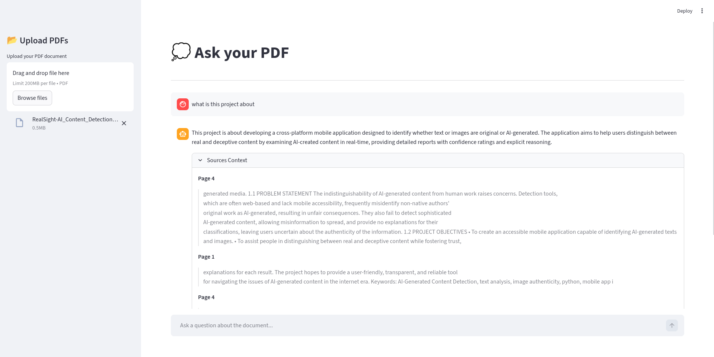

# 📄 AskPDF

A fast, lightweight Retrieval-Augmented Generation (RAG) web application that lets you upload PDF documents and ask conversational questions about their content.

Built with anti-hallucination in mind, the system forces the LLM to fact-check against the provided document and explicitly cites the internal source pages it uses to formulate its answers.



## 🛠️ Tech Stack

- **Frontend Interface:** [Streamlit](https://streamlit.io/)
- **Orchestration:** [LangChain](https://python.langchain.com/)
- **Vector Database:** [ChromaDB](https://www.trychroma.com/) (Local Persistence)
- **Embeddings & LLM:** Google Gemini via `langchain-google-genai`

## 🚀 How to Run (Local Setup)

**1. Clone the repository and navigate to it:**
```bash
git clone https://github.com/upendrapant/askpdf.git
cd askpdf
```

**2. Create a virtual environment and install dependencies:**
```bash
python3 -m venv .venv
source .venv/bin/activate
pip install -r requirements.txt
```

**3. Set up your API Keys:**
```bash
cp .env.template .env
```
Open `.env` and add your `GOOGLE_API_KEY` (available for free from [Google AI Studio](https://aistudio.google.com/app/apikey)).

**4. Start the Streamlit application:**
```bash
streamlit run app.py
```

The app will launch in your default browser at `http://localhost:8501`.

## 📁 Project Structure

* `app.py`: Main Streamlit conversational interface.
* `rag/loader.py`: Handles raw PDF ingestion, scanning checks, and recursive chunk splitting.
* `rag/embedder.py`: Handles vectorising text chunks and managing ChromaDB local storage.
* `rag/retriever.py`: Executes semantic similarity searches and manages the LLM chain.
* `prompts/qa_prompt.py`: Strict system instructions forcing the LLM to cite sources and avoid outside knowledge.
